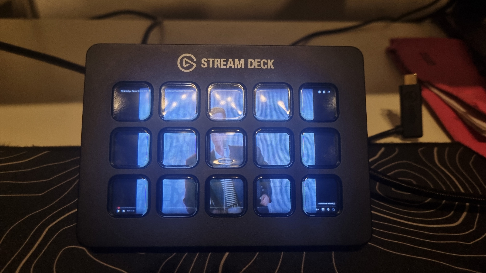

# DISPLAYDECK

This Python script allows you to use an Elgato Stream Deck as a Windows display.  

## Features
- Mirror the main display at ~5 FPS
- Touch support

## Requirements
- Elgato Stream Deck with 15 keys
- 1920x1080 main display
- Windows
- Python 3.13
- Python packages: `pillow`, `streamdeck`, `pyautogui`
- Download [hidapi](https://github.com/libusb/hidapi/releases) and put the DLLs into `C:\Windows\System32\`

## Usage
Simply run the script.
